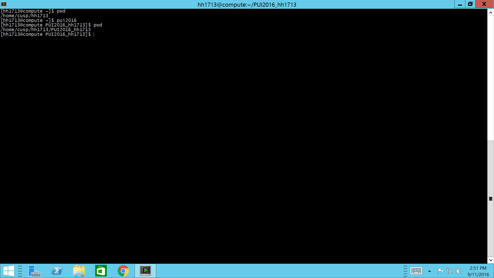

#My readme file

##Assignment 1
Finished lab1 after figuring out how to connect via remote desktop (working on windows)
Created a merge conflict and solved it
Messed with Shay Lehmann's repository

##Assignment 2
Received help from Achilles Saxby regarding figuring the .bashrc file
Encountered problems when I uploaded screenshots in the wrong folder on github (PUI2016_hh1713 instead of HW1_hh1713)
Moved the screenshots between folders in the bash shell but couldn't get the local repo and the repo on github to sync.
Avikal Somvanshi helped me with the problem - uploaded the screenshots in the correct folder on Jupiter, then:
  git add .
  git commit -m "text"
  git push
on the shell.

##Assignment 3
Received help from Avikal Somvanshi regarding the plotting part

