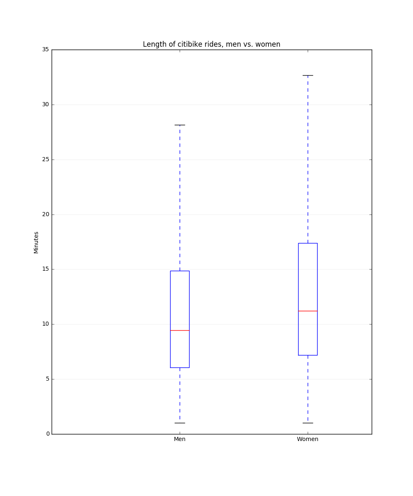

Hey Hrafnkell,

The plot is very intuitive and explains everything that you have defined and drawn from the data.

The only addition to the plot that might be needed would be:

=> The length of the plot could be smaller to accommodate the whole look of the data – the plot is rendered perfectly but it is tough to look at the whole plot in one window

=> In terms of formatting I think the Title and the Axis labels could have been made BOLD and the explanation normal – that would have made the plot stand out and the reader would not have had to look in closer to read the labels

Overall, I think it is a great plot and it represents the data very well.

