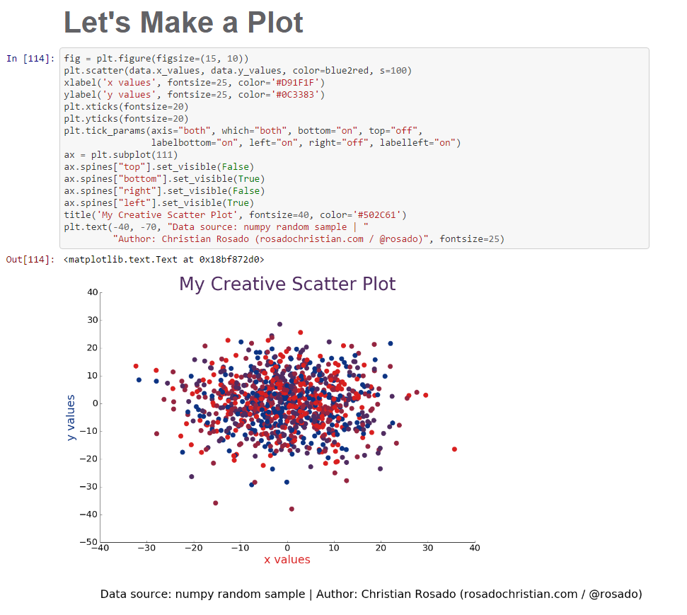

### Plot review
It is kind of difficult to review the plot as it's showing randomly generated numbers instead of real data. 

Axis: Axis would need to be renamed if you were depicting real data (the same goes for the title). Also is there a reason the x-axis and y-axis are written in the same colors used to plot some of the dots in the scatter? Do the red dots apply to the x-axis and the blue dots to the y-axis? Probably not but it might cause confusion.

Colors: The bright red and blue colors are easily visible. However I have a hard time seeing the difference between the darker two colors used.

Size: The plot could be bigger, would make the clustering clearer.

Legend: What do the individual colors mean (if depicting real data)?

Best,
Keli!
